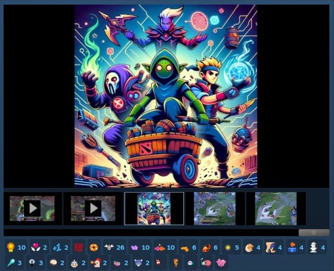

# Open Hyper AI (OHA) - Dota 2 Bot Scripts

**The most feature-rich custom bot script for Dota 2.** Play against bots that actually fight, farm, push, and use items intelligently.

> **To play:** Create a **Custom Lobby** and select **Local Host** as the server location. Bots should have names ending with **".OHA"** when installed correctly.

[Steam Workshop](https://steamcommunity.com/sharedfiles/filedetails/?id=3246316298) | [GitHub](https://github.com/forest0xia/dota2bot-OpenHyperAI) | [Feature Requests](https://github.com/forest0xia/dota2bot-OpenHyperAI/issues?q=is%3Aissue+is%3Aopen+%5BFeature+request%5D)



---

## What Makes This Different

- **127 heroes supported** on Patch 7.41/7.41a - including Largo, Kez, Ringmaster, Invoker, Techies, Meepo, Lone Druid, and more
- **Bots actually play the game** - they lane, gank, push towers, defend, farm jungle, take Roshan, and use active items
- **Dynamic difficulty (FretBots mode)** - bots get unfair bonuses that scale with difficulty for a real challenge
- **Bots communicate** - they announce pushes, defends, Roshan, and respond to your pings with "On my way!" (in 4 languages)
- **10+ Game modes supported** - All pick, Turbo, All random, Captain mode, 1v1 mid, All Random Deathmatch, etc.
- **Customizable everything** - bot names, roles, hero picks, bans, item builds, skill builds, and more
- **AI Chatbot** - bots chat like real (toxic) players (requires FretBots mode)
- **All roles supported** - deterministic position 1-5 lane assignment

---

## Quick Start

1. Subscribe on [Steam Workshop](https://steamcommunity.com/sharedfiles/filedetails/?id=3246316298)
2. Create a **Custom Lobby** with **Local Host** server
3. Start the game - bots auto-pick and play

For **FretBots mode** (harder bots, neutral items, chatbot): [Manual installation guide](https://github.com/forest0xia/dota2bot-OpenHyperAI/discussions/68)

---

## This Fork: FightIQ + ML Server — Install Guide

This fork adds smarter fight logic (`Customize.FightIQ`) and an optional ML
model server (`ml/`) on top of OpenHyperAI. These need a **manual install** —
the upstream Workshop item does NOT have them.

### Step 1 — Get the scripts

```bash
git clone https://github.com/danlniel/dota2bot-neigh.git
```
(or Code → Download ZIP and extract)

### Step 2 — Copy `bots/` into Dota 2

Copy the repo's `bots/` folder into your Dota 2 vscripts folder:

| OS | vscripts folder |
|---|---|
| Windows | `C:\Program Files (x86)\Steam\steamapps\common\dota 2 beta\game\dota\scripts\vscripts` |
| Linux | `~/.steam/steam/steamapps/common/dota 2 beta/game/dota/scripts/vscripts` |
| macOS | `~/Library/Application Support/Steam/steamapps/common/dota 2 beta/game/dota/scripts/vscripts` |

Correct result: `...\vscripts\bots\hero_selection.lua` exists.

### Step 3 — Configure (THIS is where the API key goes)

Open **`...\vscripts\bots\Customize\general.lua`** in any text editor.
Everything you can tune is in this ONE file:

```lua
-- Bot difficulty 0-10 (stat/gold bonuses, FretBots)
Customize.Fretbots = {
    Default_Difficulty = 10,      -- used if nobody votes in chat
    Allow_To_Vote = true,         -- type a number 0-10 in chat at game start to vote
    ...
}

-- Fight intelligence (this fork). true = smarter fights
Customize.FightIQ = {
    Enable = true,
    ...
}

-- ML server connection (this fork) — THE API KEY GOES HERE:
Customize.ML = {
    Enable = true,
    Server = 'https://dota.sunarjodaniel.xyz',      -- or your own server
    Api_Key = 'PASTE-THE-KEY-YOU-WERE-GIVEN-HERE',  -- <<<<< here
    ...
}
```

No key / no server? Just set `Customize.ML.Enable = false` — everything else
still works, bots simply use the static settings.

> Tip: copy the whole `Customize` folder to `...\vscripts\game\Customize` —
> settings there survive script updates.

### Step 4 — Play

1. Dota 2 → Play → **Custom Lobby** → Server Location: **Local Host**.
2. Add bots, start. Bot names ending in **".OHA"** = install worked.
3. Difficulty: type a number **0–10 in all-chat** during hero pick to vote
   (e.g. `5`), or it falls back to `Default_Difficulty`.

### (Optional) Run your own ML server

Only needed if you don't use the hosted one:

```bash
python3 ml/server.py                      # simplest: run before the lobby
# or always-on with Docker (works on ARM boards like OrangePi):
cd ml && docker compose up -d --build
```

Health check: `GET /health`. Train on collected games: `python3 ml/train.py`,
then restart the server. Details: [ml/README.md](ml/README.md), deployment
example: [ml/DEPLOYMENT.md](ml/DEPLOYMENT.md).

---

## In-Game Commands

| Command | Description |
|---|---|
| `!pos X` | Swap your role with a bot (e.g., `!pos 2` for mid) |
| `!Xpos Y` | Reassign bot positions (e.g., `!3pos 5` = 3rd bot plays pos 5) |
| `!pick HERO` | Pick a hero (`!pick sniper`, or `/all !pick sniper` for enemy) |
| `!ban HERO` | Ban a hero from being picked |
| `!sp XX` | Set bot language (`en`, `zh`, `ru`, `ja`) |

Use [internal hero names](https://github.com/forest0xia/dota2bot-OpenHyperAI/discussions/71) if short names overlap (e.g., `!pick npc_dota_hero_keeper_of_the_light`). Batch commands work too: `!pick io; !ban sniper`.

---

## Bot Roles & Positioning

Lobby slot order = position assignment (1-5):

| Position | Lane |
|---|---|
| Pos 1 (Carry) + Pos 5 (Hard Support) | Safe Lane |
| Pos 2 (Mid) | Mid Lane |
| Pos 3 (Offlane) + Pos 4 (Soft Support) | Offlane |

Customize picks, bans, and roles in [Customize/general.lua](bots/Customize/general.lua).

---

## Customization

| What | Where |
|---|---|
| General settings (picks, bans, names, roles) | [Customize/general.lua](bots/Customize/general.lua) |
| Per-hero settings (items, skills) | [Customize/hero/viper.lua](bots/Customize/hero/viper.lua) |
| FretBots difficulty tuning | [FretBots/SettingsDefault.lua](bots/FretBots/SettingsDefault.lua) |

**Permanent customization** (survives Workshop updates): Copy the `Customize` folder to `<Steam/steamapps/common/dota 2 beta/game/dota/scripts/vscripts/game/Customize>`.

---

## Game Modes

Supports most game modes (10+) . See [full compatibility discussion](https://github.com/forest0xia/dota2bot-OpenHyperAI/discussions/72).

---

## Offline / LAN Play

You can start a bot game directly from the console without network or clicking UI buttons — useful for offline play, LAN parties, or quick testing. See [play offline setup guide](https://github.com/forest0xia/dota2bot-OpenHyperAI/discussions/135).

---

## Developer Documentation

This project uses [Claude Code](https://claude.ai/claude-code) for AI-assisted development. The [CLAUDE.md](CLAUDE.md) file provides task-specific instructions for common operations like patch updates, hero fixes, and adding new heroes.

### Key Docs

| Document | Description |
|---|---|
| [docs/ARCHITECTURE.md](docs/ARCHITECTURE.md) | Complete codebase architecture, file map, naming conventions, all systems explained |
| [docs/PATCH_UPDATE_GUIDE.md](docs/PATCH_UPDATE_GUIDE.md) | Step-by-step runbook for updating when a new Dota 2 patch drops |
| [docs/BOT_API_REFERENCE.md](docs/BOT_API_REFERENCE.md) | Comprehensive Valve bot scripting API reference with examples |
| [CLAUDE.md](CLAUDE.md) | AI coding assistant guide - common tasks, rules, and workflows |

### Internal Name References

Dota 2 bot scripts use internal code names for heroes, items, and abilities. These are different from the display names you see in-game. When updating builds or fixing bugs, always verify against authoritative sources:

| Resource | What It Contains |
|---|---|
| [Liquipedia Cheats Page (Item Names)](https://liquipedia.net/dota2/Cheats) | Authoritative list of `item_*` internal names for all items including neutral items |
| [d2vpkr npc_abilities.txt](https://raw.githubusercontent.com/dotabuff/d2vpk/master/dota_pak01/scripts/npc/npc_abilities.txt) | All ability internal names and KV data |
| [Dota 2 Patch Data API](https://www.dota2.com/datafeed/patchnoteslist?language=english) | Official patch notes in machine-readable format |
| [Modifier Names (Valve Wiki)](https://developer.valvesoftware.com/wiki/Dota_2_Workshop_Tools/Scripting/Built-In_Modifier_Names) | `modifier_*` names for buff/debuff detection |

### Project Structure

```
root: <Steam/steamapps/common/dota 2 beta/game/dota/scripts/vscripts>
|
+-- bots/                  All bot Lua scripts
|   +-- hero_selection.lua     Hero picking/banning
|   +-- bot_generic.lua        Per-bot entry point
|   +-- ability_item_usage_generic.lua   Ability/item usage for all heroes
|   +-- item_purchase_generic.lua        Item purchase state machine
|   +-- mode_*_generic.lua     Mode scripts (farm, push, defend, roam, etc.)
|   +-- mode_assemble_generic.lua        Human ping response
|   |
|   +-- BotLib/            Per-hero builds (items, skills, ability logic)
|   |   +-- hero_axe.lua, hero_crystal_maiden.lua, ...
|   |
|   +-- FunLib/            Core libraries and utilities
|   |   +-- jmz_func.lua      Main utility library
|   |   +-- aba_item.lua      Item system
|   |   +-- aba_skill.lua     Skill/ability system
|   |   +-- aba_push.lua      Push logic
|   |   +-- aba_defend.lua    Defend logic
|   |   +-- localization.lua  Chat translations (en/zh/ru/ja)
|   |
|   +-- FretBots/          Enhanced difficulty mode
|   |   +-- SettingsDefault.lua    Difficulty tuning
|   |   +-- SettingsNeutralItemTable.lua   Neutral items + enchantments
|   |
|   +-- Customize/         User-editable settings
|       +-- general.lua    Team-level settings
|       +-- hero/          Per-hero overrides
|
+-- typescript/            TypeScript source for TS-generated Lua files
|   +-- bots/              TS versions (compiled to bots/ via tstl)
|   +-- post-process/      Post-compilation scripts
|
+-- game/                  Valve defaults + permanent customization location
|   +-- Customize/         Copy your Customize/ here to survive updates
|
+-- docs/                  Developer documentation
    +-- ARCHITECTURE.md
    +-- PATCH_UPDATE_GUIDE.md
    +-- BOT_API_REFERENCE.md
```

---

## Contribute

- Contributions welcome on [GitHub](https://github.com/forest0xia/dota2bot-OpenHyperAI)
- Custom item/skill builds don't need PRs - just tweak locally
- Future development is in **TypeScript** for better maintainability
- [Open feature requests](https://github.com/forest0xia/dota2bot-OpenHyperAI/issues?q=is%3Aissue+is%3Aopen+%5BFeature+request%5D)

---

## What's Next

- Current bot playstyle is limited by Valve's API. **We need ML/LLM bots like OpenAI Five!**
- Planned improvements:
  - Smarter laning, pushing, ganking
  - Stronger spell casting (Invoker, Rubick, Morphling, etc.)
  - Better support for bugged heroes (Dark Willow, IO, Lone Druid, Muerta, etc.)
  - Full game mode support + ongoing patch fixes
- [Feedback to Valve Dota2 bot team](https://www.reddit.com/r/DotA2/comments/1ezxpav/)

---

## Useful Resources

| Resource | Description |
|---|---|
| [Dota2 AI Development Tutorial](https://www.adamqqq.com/ai/dota2-ai-devlopment-tutorial.html) | Comprehensive guide by adamqqq |
| [Valve Bot Scripting Intro](https://developer.valvesoftware.com/wiki/Dota_Bot_Scripting) | Official Valve documentation |
| [Lua Bot APIs (moddota)](https://docs.moddota.com/lua_bots/) | Community API docs |
| [Liquipedia Cheats (Internal Names)](https://liquipedia.net/dota2/Cheats) | Item/hero/ability code names |
| [npc_abilities.txt](https://raw.githubusercontent.com/dotabuff/d2vpk/master/dota_pak01/scripts/npc/npc_abilities.txt) | Ability metadata |
| [Enums & APIs (moddota)](https://moddota.com/api/#!/vscripts/dotaunitorder_t) | Enum reference |
| [Modifier Names](https://developer.valvesoftware.com/wiki/Dota_2_Workshop_Tools/Scripting/Built-In_Modifier_Names) | Buff/debuff modifier names |

---

## Support

- Contribute on GitHub
- Or [buy me a coffee](https://github.com/forest0xia/dota2bot-OpenHyperAI/discussions/74)

---

## Credits

Built on top of Valve's default bots + contributions from many talented authors:

- New Beginner AI ([dota2jmz@163.com](mailto:dota2jmz@163.com))
- Tinkering About ([ryndrb](https://github.com/ryndrb/dota2bot))
- Ranked Matchmaking AI ([adamqqq](https://github.com/adamqqqplay/dota2ai))
- fretbots ([fretmute](https://github.com/fretmute/fretbots))
- BOT Experiment (Furiospuppy)
- ExtremePush ([insraq](https://github.com/insraq/dota2bots))
- And all other contributors who made bot games better
